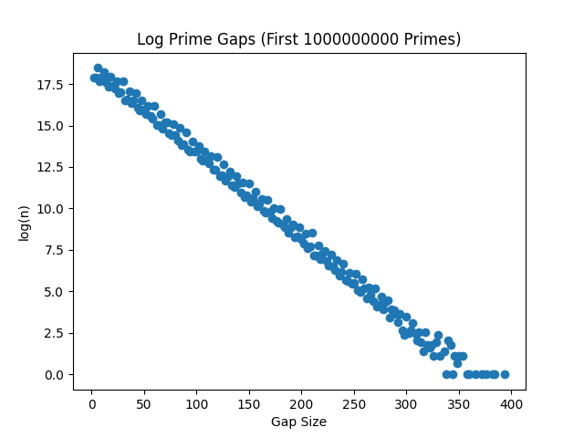

# Prime Gaps Line

This repository is in response to the Stand-up Maths video at
https://www.youtube.com/watch?v=SMsTXQYgbiQ, specifically intended to answer
the question

"I have no idea what the shape will be. Does the line get thicker and thicker,
meaning the top pointy bit will travel that way, or does the shape change? I
don't know: I looked around, I couldn't find out. If you know, let me know."

This wasn't successful in that goal, but it did move the plot from 150m primes
to 1b, without effecting the overall shape. This isn't too surprising given that
it takes 10^35 primes before 30 becomes the top dot!

1 billion primes plot:

